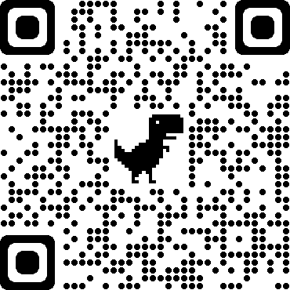

# v-area-picker
一个移动端地址选择组件

## 开始

### 使用npm或yarn安装:

```bash
$ npm install v-area-picker --save
```
或

```bash
$ yarn add v-area-picker
```

### 全局引入

  ```js
  import Vue from 'vue'
  import VAreaPicker from 'v-area-picker'

  Vue.use(VAreaPicker)
  ```

### 按需引用
1、 安装babel-plugin-import

  ```bash
  npm install babel-plugin-import --dev
  ```

2、 babel.config.js

  ```js
  module.exports = {
    plugins: [
      [
        'import',
        {
          libraryName: 'v-area-picker',
          customName: name => {
            return `v-area-picker/dist/${name}`
          }
        },
        'v-area-picker'
      ]
    ]
  }

  ```
3、 按需加载 Tabs, Picker, ActionSheet组件

  ```js
  import Vue from 'vue'
  import { VTabs, VPicker, VActionSheet } from 'v-area-picker'

  Vue.use(VTabs)
  Vue.use(VPicker)
  Vue.use(VActionSheet)
  ```

  ### 快速预览
  手机扫描二维码

  
